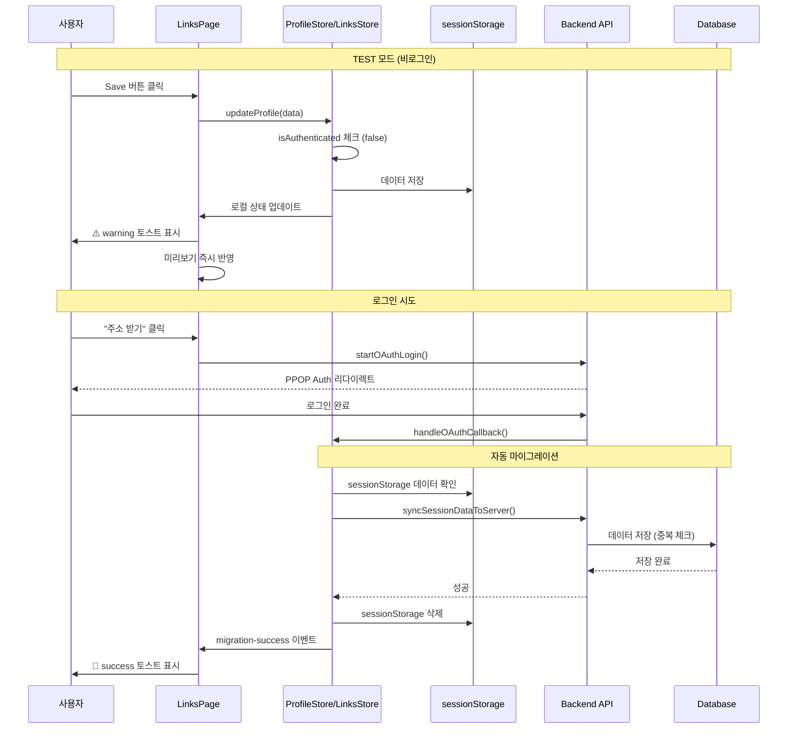

# TEST 모드 localStorage 저장 구현

## 개요

비로그인 사용자(TEST 모드)가 sessionStorage에 데이터를 저장하고 실시간 미리보기를 확인할 수 있도록 개선. 로그인 유도는 '주소 받기' 시점으로 이동하여 자연스러운 전환 유도.

## 핵심 변경사항

### 1. 타입 시스템 확장

**파일**: [`web/src/app/dashboard/links/page.tsx`](web/src/app/dashboard/links/page.tsx)Toast 메시지 타입에 `warning` 추가:

```typescript
type: "success" | "error" | "warning"
```


### 2. Save 버튼 로직 수정 (로그인 유도 제거)

**파일**: [`web/src/app/dashboard/links/page.tsx`](web/src/app/dashboard/links/page.tsx) (307-348번 라인)**현재**: 비로그인 시 로그인 확인 모달 표시 (310-314번 라인)

```typescript
if (!isAuthenticated) {
  setIsLoginConfirmOpen(true);
  return;
}
```

**변경 후**:

- TEST 모드: sessionStorage에 저장 (기존 store 로직 활용)
- 저장 성공 후 즉시 warning 토스트 표시
- 로그인 유저: 기존과 동일 (DB 저장)
```typescript
const handleSaveProfile = async () => {
  if (isProfileSaving || !isProfileDirty) return;

  setIsProfileSaving(true);
  setProfileSaveMessage(null);
  clearProfileError();

  try {
    // sessionStorage 저장은 store에서 자동 처리됨
    await updateProfile({
      display_name: formData.display_name || undefined,
      bio: formData.bio || undefined,
      background_color: formData.background_color,
      button_style: formData.button_style,
    });

    setOriginalFormData({ ...formData });
    
    if (!isAuthenticated) {
      // TEST 모드: warning 토스트
      setProfileSaveMessage({
        type: "warning",
        text: "⚠️ 임시 저장됨. 로그인하여 영구 저장하세요!",
      });
    } else {
      // 로그인 유저: success 토스트
      setProfileSaveMessage({
        type: "success",
        text: "저장되었습니다!",
      });
    }

    setTimeout(() => setProfileSaveMessage(null), 5000);
  } catch (error) {
    console.error("Failed to save profile:", error);
    setProfileSaveMessage({
      type: "error",
      text: "저장 실패. 다시 시도해주세요.",
    });
  } finally {
    setIsProfileSaving(false);
  }
};
```


### 3. Toast UI에 warning 스타일 추가

**파일**: [`web/src/app/dashboard/links/page.tsx`](web/src/app/dashboard/links/page.tsx)Toast 메시지 렌더링 부분에 warning 스타일 추가:

```typescript
{profileSaveMessage && (
  <div
    className={`mt-2 rounded-md p-2 text-xs ${
      profileSaveMessage.type === "success"
        ? "bg-green-50 text-green-700 border border-green-200"
        : profileSaveMessage.type === "error"
        ? "bg-red-50 text-red-700 border border-red-200"
        : "bg-yellow-50 text-yellow-700 border border-yellow-300" // warning
    }`}
  >
    {profileSaveMessage.text}
  </div>
)}
```


### 4. 공유 링크 섹션 UI 개선

**파일**: [`web/src/app/dashboard/links/page.tsx`](web/src/app/dashboard/links/page.tsx) (955-1038번 라인)**현재**: 모든 사용자에게 동일한 UI (publicProfileUrl 표시)**변경 후**:

- **TEST 모드**: Input placeholder 스타일 + '주소 받기' 버튼 (로그인 유도)
- **로그인 + 주소 발급됨**: Input + 3개 버튼 (복사, 새 탭, 새로고침)
- **로그인 + 주소 미발급**: '✅ 주소 발급됨' 비활성화 버튼 표시
```typescript
<Card>
  <CardHeader className="py-3 px-4">
    <CardTitle className="text-sm">내 페이지 공유</CardTitle>
  </CardHeader>
  <CardContent className="p-4 pt-0 space-y-3">
    {!isAuthenticated ? (
      // TEST 모드
      <>
        <div className="relative">
          <Input
            value=""
            readOnly
            placeholder="주소를 발급해주세요"
            className="text-sm text-gray-400 bg-gray-50"
          />
        </div>
        <Button
          variant="primary"
          className="w-full text-sm"
          onClick={handleGetShareLink}
        >
          🔗 주소 받기
        </Button>
        <p className="text-[10px] text-gray-400 text-center">
          로그인이 필요합니다
        </p>
      </>
    ) : publicProfileUrl ? (
      // 로그인 + 주소 발급됨
      <>
        <Input
          value={publicProfileUrl}
          readOnly
          className="text-sm"
        />
        <div className="flex gap-2">
          <Button
            variant="primary"
            className="flex-1"
            onClick={handleCopyLink}
          >
            {isCopied ? "✓ 복사됨" : "복사"}
          </Button>
          <Button
            variant="secondary"
            className="flex-1"
            onClick={handleOpenMyPage}
          >
            새 탭에서 열기
          </Button>
          <Button
            variant="outline"
            onClick={handleGetShareLink}
          >
            새로고침
          </Button>
        </div>
      </>
    ) : (
      // 로그인 + 주소 미발급
      <>
        <Input
          value=""
          readOnly
          placeholder="주소를 발급해주세요"
          className="text-sm text-gray-400 bg-gray-50"
        />
        <Button
          variant="secondary"
          className="w-full text-sm"
          onClick={handleGetShareLink}
          disabled={publicProfileUrl !== ""}
        >
          ✅ 주소 발급됨
        </Button>
      </>
    )}
  </CardContent>
</Card>
```


### 5. 프로필 이미지 업로드 제한

**파일**: [`web/src/app/dashboard/links/page.tsx`](web/src/app/dashboard/links/page.tsx)이미지 업로드 버튼 클릭 시 TEST 모드 체크:

```typescript
const handleImageClick = () => {
  if (!isAuthenticated) {
    setProfileSaveMessage({
      type: "warning",
      text: "⚠️ 프로필 이미지는 로그인 후 업로드 가능합니다",
    });
    setTimeout(() => setProfileSaveMessage(null), 3000);
    return;
  }
  fileInputRef.current?.click();
};
```


### 6. 마이그레이션 중복 방지 로직

**파일**: [`web/src/store/linksStore.ts`](web/src/store/linksStore.ts) (375-409번 라인)`syncLinksDataToServer` 함수 개선:

```typescript
syncLinksDataToServer: async () => {
  const { isAuthenticated } = useAuthStore.getState();
  if (!isAuthenticated) return;

  const tempLinks = get().links.filter((link: Link) => link.id.startsWith("temp_"));
  const tempSocialLinks = get().socialLinks.filter((link: SocialLink) => link.id.startsWith("temp_"));
  
  if (tempLinks.length === 0 && tempSocialLinks.length === 0) return;
  
  try {
    // 기존 링크 가져오기
    await get().fetchLinks();
    await get().fetchSocialLinks();
    
    const existingLinks = get().links.filter((link: Link) => !link.id.startsWith("temp_"));
    const existingSocialLinks = get().socialLinks.filter((link: SocialLink) => !link.id.startsWith("temp_"));
    
    // 중복 체크 (제목 + URL)
    for (const link of tempLinks) {
      const isDuplicate = existingLinks.some(
        (existing) => existing.title === link.title && existing.url === link.url
      );
      if (!isDuplicate) {
        await linksApi.createLink({
          title: link.title,
          url: link.url,
        });
      }
    }
    
    // 소셜 링크 중복 체크 (플랫폼)
    for (const socialLink of tempSocialLinks) {
      const isDuplicate = existingSocialLinks.some(
        (existing) => existing.platform === socialLink.platform
      );
      if (!isDuplicate) {
        await linksApi.createSocialLink({
          platform: socialLink.platform,
          url: socialLink.url,
        });
      }
    }
    
    // 성공 토스트 (컴포넌트에서 처리)
    get().clearLinksSessionStorage();
    
    // 최신 데이터 다시 로드
    await get().fetchLinks();
    await get().fetchSocialLinks();
  } catch (error) {
    console.error("Failed to sync links data to server:", error);
    throw error; // 에러를 상위로 전파
  }
},
```


### 7. 마이그레이션 성공 알림

**파일**: [`web/src/store/authStore.ts`](web/src/store/authStore.ts) (113-122번 라인)마이그레이션 성공 시 알림 추가:

```typescript
// 세션 스토리지 데이터를 서버로 동기화
try {
  const { useProfileStore } = await import("./profileStore");
  const { useLinksStore } = await import("./linksStore");
  
  await useProfileStore.getState().syncSessionDataToServer();
  await useLinksStore.getState().syncLinksDataToServer();
  
  // 성공 알림 (전역 상태 또는 이벤트로 전달)
  if (typeof window !== "undefined") {
    window.dispatchEvent(new CustomEvent("migration-success"));
  }
} catch (error) {
  console.error("Failed to sync session data to server:", error);
}
```

**파일**: [`web/src/app/dashboard/links/page.tsx`](web/src/app/dashboard/links/page.tsx)마이그레이션 성공 이벤트 리스너:

```typescript
useEffect(() => {
  const handleMigrationSuccess = () => {
    setProfileSaveMessage({
      type: "success",
      text: "🎉 TEST 데이터가 성공적으로 저장되었습니다!",
    });
    setTimeout(() => setProfileSaveMessage(null), 5000);
  };

  window.addEventListener("migration-success", handleMigrationSuccess);
  return () => {
    window.removeEventListener("migration-success", handleMigrationSuccess);
  };
}, []);
```


### 8. 마이그레이션 실패 처리

**파일**: [`web/src/app/dashboard/links/page.tsx`](web/src/app/dashboard/links/page.tsx)에러 상태 추가 및 재시도 버튼:

```typescript
const [migrationError, setMigrationError] = useState(false);

const handleRetryMigration = async () => {
  try {
    const { useProfileStore } = await import("@/store/profileStore");
    const { useLinksStore } = await import("@/store/linksStore");
    
    await useProfileStore.getState().syncSessionDataToServer();
    await useLinksStore.getState().syncLinksDataToServer();
    
    setMigrationError(false);
    setProfileSaveMessage({
      type: "success",
      text: "🎉 TEST 데이터가 저장되었습니다!",
    });
  } catch (error) {
    setProfileSaveMessage({
      type: "error",
      text: "마이그레이션 실패. 다시 시도해주세요.",
    });
  }
};
```


## 데이터 흐름




## 구현 체크리스트

- [ ] Toast 메시지 타입에 `warning` 추가
- [ ] `handleSaveProfile` 함수에서 로그인 확인 모달 제거
- [ ] TEST 모드 warning 토스트 추가
- [ ] Toast UI에 warning 스타일 추가
- [ ] 공유 링크 섹션 UI 3가지 상태 구현
- [ ] 프로필 이미지 업로드 TEST 모드 제한
- [ ] `syncLinksDataToServer` 중복 방지 로직 추가
- [ ] 마이그레이션 성공 이벤트 처리
- [ ] 마이그레이션 실패 처리 및 재시도 버튼
- [ ] 로그인 확인 모달 컴포넌트 제거 (더 이상 사용 안 함)

## 테스트 시나리오

1. **TEST 모드 저장**

- 비로그인 상태에서 프로필 편집
- Save 클릭 → warning 토스트 확인
- 미리보기에 즉시 반영 확인
- 페이지 새로고침 → 데이터 유지 확인

2. **로그인 유도**

- "주소 받기" 클릭 → 로그인 페이지 이동
- 로그인 완료 후 대시보드 복귀

3. **자동 마이그레이션**

- 로그인 직후 success 토스트 확인
- 링크 목록에 TEST 데이터 반영 확인
- sessionStorage 삭제 확인

4. **중복 방지**

- 로그인 전 링크 3개 생성
- 로그인 후 동일 링크 추가 시도
- 중복 제외되고 새 링크만 추가 확인

5. **에러 처리**

- 네트워크 끊고 마이그레이션 시도
- 에러 토스트 + sessionStorage 유지 확인